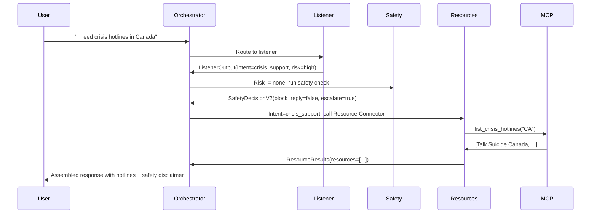

# OMHC Codebase Walkthrough

## Overview

The **Open Mental Health Collective (OMHC)** is a multi-agent, non-clinical mental health support system built with Google's Agent Development Kit (ADK). It demonstrates safety-first AI design for sensitive mental health contexts.

---

## Core Architecture

### Multi-Agent System (6 Agents)

#### 1. **Orchestrator Agent** ([agent.py](file:///home/wadej/2026/projects/OMHC/agents/orchestrator_agent/agent.py))
- **Type**: Custom `BaseAgent` (`MentalHealthOrchestrator`)
- **Role**: Root agent coordinating all other agents
- **Key Responsibilities**:
  - Multi-phase routing logic (listener → safety → therapy/resources)
  - Maintains shared `session.state` with schema version (`omhc_v2_0_0`)
  - Enforces safety ceiling (blocks content when `block_reply=true`)
  - Assembles final user-facing responses from state

**Routing Flow**:
```
1. Always run Listener first
2. Run Safety if risk_level != "none" OR intent == "crisis_support"
3. If Safety.block_reply == true → crisis message only, stop
4. Route by intent:
   - unknown → clarification
   - resource_navigation/crisis_support → Resource Connector
   - check_in/psychoeducation/skills_practice → Therapy Coach (if allowed)
5. Assemble final response from state
```

#### 2. **Listener Agent** ([agent.py](file:///home/wadej/2026/projects/OMHC/agents/listener_agent/agent.py))
- **Type**: `LlmAgent` with structured output
- **Output Schema**: `ListenerOutput`
- **Key Functions**:
  - Empathic reflection (1-3 sentences)
  - Intent detection (conservative: defaults to `"unknown"` if <70% confident)
  - Initial risk screening (5 levels: none, low, medium, high, crisis)
  - Sets `immediate_escalation_required` flag for imminent danger

**Intent Categories**:
- `check_in`, `psychoeducation`, `skills_practice`, `resource_navigation`, `crisis_support`, `unknown`

#### 3. **Safety & Ethics Agent** ([agent.py](file:///home/wadej/2026/projects/OMHC/agents/safety_ethics_agent/agent.py))
- **Type**: `LlmAgent` with structured output
- **Output Schema**: `SafetyDecisionV2`
- **Key Decisions**:
  - `overall_risk_level`: Refined risk assessment
  - `allow_self_help`: Can Therapy Coach provide content?
  - `block_reply`: Hard safety ceiling (no self-help, only crisis message)
  - `should_escalate_to_human`: Recommend professional help
  - `escalation_channel`: crisis_hotline, emergency_services, etc.
  - `policy_tags`: Categorizes risk (e.g., `suicidality_imminent`, `violence_risk`)

**Safety Invariants**:
- `block_reply=true` ⇒ `allow_self_help=false` (enforced by Pydantic validator)
- `escalation_channel` set ⇒ `should_escalate_to_human=true`

#### 4. **Therapy Coach Agent** ([agent.py](file:///home/wadej/2026/projects/OMHC/agents/therapy_coach_agent/agent.py))
- **Type**: `LlmAgent` with structured output
- **Output Schema**: `TherapyPlan`
- **Provides**: Brief, low-intensity self-help (CBT/MBSR)
- **Content**: Breathing exercises, grounding, cognitive reframing
- **Guardrails**: Only runs if `allow_self_help=true` and `block_reply=false`

#### 5. **Resource Connector Agent** ([agent.py](file:///home/wadej/2026/projects/OMHC/agents/resource_connector_agent/agent.py))
- **Type**: `LlmAgent` with tools
- **Output Schema**: `ResourceResults`
- **Tools**:
  - Google Search (always available)
  - MCP crisis hotlines tool (if `MENTAL_HEALTH_MCP_URL` configured)
- **Returns**: Structured list of resources (crisis lines, services, official sites)

#### 6. **Debug State Agent** ([agent.py](file:///home/wadej/2026/projects/OMHC/agents/debug_state_agent/agent.py))
- **Type**: `BaseAgent`
- **Purpose**: Developer-only state inspection
- **Exposes**: `schema_version`, `listener_output`, `safety_decision_v2`
- **Access**: Via ADK CLI, not exposed to end users

---

## Data Schemas ([schemas.py](file:///home/wadej/2026/projects/OMHC/schemas/schemas.py))

All schemas are Pydantic `BaseModel` subclasses for type safety and validation.

### Key Schemas

**`ListenerOutput`**:
- `normalized_utterance`: Paraphrased user input
- `detected_emotion`: Inferred emotion
- `user_intent`: 6 categories + unknown
- `risk`: Nested `ListenerRisk` object

**`SafetyDecisionV2`**:
- Provides machine-actionable safety gates
- Includes operator-friendly metadata (`policy_tags`, `notes_for_operators`)
- Built-in Pydantic validators enforce safety invariants

**`TherapyPlan`**:
- `approach`: CBT, MBSR, mixed, other
- `focus`: stress, mood, anxiety, grounding
- `coach_message`: Brief guidance
- `steps`: List of `TherapyStep` objects

**`ResourceResults`**:
- `user_facing_summary`: Natural language summary
- `resources`: List of `ResourceItem` objects (name, url, region_hint, description)

---

## Agent Instructions (Prompts)

All agents have markdown instruction files in [prompts/](file:///home/wadej/2026/projects/OMHC/prompts):

| Agent | Instruction File | Key Focus |
|-------|-----------------|-----------|
| Orchestrator | [orchestrator_instruction.md](file:///home/wadej/2026/projects/OMHC/prompts/orchestrator_instruction.md) | Routing logic, safety enforcement |
| Listener | [listener_instruction.md](file:///home/wadej/2026/projects/OMHC/prompts/listener_instruction.md) | Conservative intent detection, risk screening |
| Safety | [safety_instruction.md](file:///home/wadej/2026/projects/OMHC/prompts/safety_instruction.md) | SafetyDecisionV2 rules, crisis handling |
| Therapy Coach | [therapy_coach_instruction.md](file:///home/wadej/2026/projects/OMHC/prompts/therapy_coach_instruction.md) | Brief self-help, no diagnosis/treatment |
| Resource Connector | [resource_connector_instruction.md](file:///home/wadej/2026/projects/OMHC/prompts/resource_connector_instruction.md) | MCP tools, search strategies |

**Design Philosophy**: Instructions are explicit, conservative, and emphasize the system's limitations (not a therapist, not emergency services).

---

## Integration Components

### MCP (Model Context Protocol)

**Server**: [omhc_mcp_server.py](file:///home/wadej/2026/projects/OMHC/mcp/omhc_mcp_server.py)
- Built with `FastMCP`
- Tool: `list_crisis_hotlines(country_code)` → returns crisis hotlines for US, CA, etc.
- Mock implementation (expandable with real data sources)

**Client Integration**:
- Resource Connector Agent optionally connects via `MCPToolset` + `SseConnectionParams`
- Configured via `MENTAL_HEALTH_MCP_URL` environment variable
- Async initialization in `configure_mcp_tools()`

### A2A (Agent-to-Agent Interoperability)

**Server**: [omhc_a2a_server.py](file:///home/wadej/2026/projects/OMHC/omhc_a2a_server.py)
- Exposes orchestrator as HTTP endpoint using `to_a2a()`
- Served via Uvicorn (FastAPI under hood)
- Agent card at `/a2a/open_mhc_orchestrator/.well-known/agent.json`

**Client**: [client_agent.py](file:///home/wadej/2026/projects/OMHC/a2a_client/client_agent.py)
- `RemoteA2aAgent` consuming OMHC orchestrator
- Connects to server via `OMHC_A2A_BASE_URL`
- Enables external systems to use OMHC as a remote agent

---

## Safety Mechanisms

### Three-Layer Defense

#### Layer 1: Listener Risk Screen
- Conservative risk classification
- Flags `immediate_escalation_required` for plans/means/timeframe
- Extracts `crisis_keywords` from user text

#### Layer 2: SafetyDecisionV2 Gate
- Deeper analysis with policy tags
- Sets behavioral flags (`allow_self_help`, `block_reply`)
- Provides `user_message_override` for crisis situations

#### Layer 3: Orchestrator Safety Ceiling
- Programmatic enforcement before final response
- If `block_reply=true`:
  - Skips Therapy Coach
  - Uses crisis override message
  - No self-help content
- If `allow_self_help=false` but `block_reply=false`:
  - Can provide resources
  - No therapy exercises

### Key Principles

**Conservative Policy**:
- Ambiguous risk → treat as higher risk
- Ambiguous intent → mark as "unknown"
- When in doubt, escalate to human support

**Strict Role Separation**:
- Listener: reflection + intent/risk detection (no exercises)
- Safety: decision-making (no content provision)
- Therapy Coach: self-help content (only when allowed)
- Resource Connector: external links (no diagnosis)

---

## Testing Infrastructure

### Three Testing Layers

#### 1. Unit Tests ([tests/unit/](file:///home/wadej/2026/projects/OMHC/tests/unit))
- **[test_orchestrator_helpers.py](file:///home/wadej/2026/projects/OMHC/tests/unit/test_orchestrator_helpers.py)**: Tests for `_assemble_final_response()` function
- Validates safety invariants in schemas
- Tests state loading and coercion helpers

#### 2. Integration/E2E Tests ([tests/pytests/](file:///home/wadej/2026/projects/OMHC/tests/pytests))

**Key Files**:
- **[test_e2e_mcp_resource_flow.py](file:///home/wadej/2026/projects/OMHC/tests/pytests/test_e2e_mcp_resource_flow.py)**:
  - Starts MCP server via `fastmcp run`
  - Sends crisis prompt requesting Canada hotlines
  - Verifies response includes "Talk Suicide Canada"
  - Tests full orchestrator → Resource Connector → MCP flow

- **[test_e2e_a2a_client_mcp_resource_flow.py](file:///home/wadej/2026/projects/OMHC/tests/pytests/test_e2e_a2a_client_mcp_resource_flow.py)**:
  - Starts both MCP server and A2A server
  - Tests A2A client → A2A server → orchestrator → MCP
  - Full interoperability validation

- **[test_high_risk_safety_ceiling.py](file:///home/wadej/2026/projects/OMHC/tests/pytests/test_high_risk_safety_ceiling.py)**:
  - Tests crisis scenarios (suicidal plan, violence risk)
  - Validates `block_reply=true`, `allow_self_help=false`
  - Checks `policy_tags` (e.g., `suicidality_imminent`, `violence_risk`)

**Pytest Markers**:
- `@pytest.mark.e2e`: End-to-end tests
- `@pytest.mark.remote`: Requires remote services
- `@pytest.mark.eval_*`: Risk-level eval markers

#### 3. Remote Evals ([agent_engine_eval.py](file:///home/wadej/2026/projects/OMHC/agent_engine_eval.py))

**Purpose**: Test deployed Agent Engine instance

**Structure**:
- `EvalCase` dataclass with `must_contain` / `must_not_contain` criteria
- Tag-based groups: `low-risk`, `medium-risk`, `crisis`, `unknown-intent`
- CLI: `python agent_engine_eval.py --tag crisis`

**Example Checks**:
- Low-risk: Must contain disclaimer, must NOT contain "emergency services"
- Crisis: Must contain "emergency" and "crisis", must NOT contain exercise steps
- Unknown-intent: Must ask clarifying questions, must NOT provide exercises

### Evalsets ([tests/evals/](file:///home/wadej/2026/projects/OMHC/tests/evals))

JSON-based evalsets:
- `open_mhc_low_risk.evalset.json`
- `open_mhc_medium_risk.evalset.json`
- `open_mhc_crisis.evalset.json`
- `open_mhc_high_risk.evalset.json`
- `open_mhc_unknown_intent.evalset.json`
- `open_mhc_smoke.test.json`

---

## Configuration & Environment

### Key Environment Variables

**Model**:
- `OMHC_MODEL_NAME`: Default `"gemini-2.0-flash"`

**MCP**:
- `MENTAL_HEALTH_MCP_URL`: e.g., `http://127.0.0.1:8002/sse`

**A2A**:
- `OMHC_A2A_SERVER_HOST`: Default `127.0.0.1`
- `OMHC_A2A_SERVER_PORT`: Default `8001`
- `OMHC_A2A_BASE_URL`: e.g., `http://127.0.0.1:8001`

**Vertex AI**:
- `OMC_GCP_PROJECT_ID`
- `OMC_GCP_LOCATION`: Default `us-central1`
- `OMC_AGENT_ENGINE_RESOURCE_NAME`: Deployed agent resource name

### Project Configuration ([pyproject.toml](file:///home/wadej/2026/projects/OMHC/pyproject.toml))

**Dependencies**:
- `google-adk>=1.19.0`
- `google-cloud-aiplatform[adk,agent-engines]>=1.128.0`
- `mcp[cli]>=1.22.0`
- `pydantic>=2.12.4`

**Dev Tools**:
- `pytest`, `pytest-asyncio`
- `ruff` (linting), `mypy` (type checking)
- `uvicorn` (A2A server)

**Pytest Configuration**:
- Async mode: `auto`
- Custom markers for risk levels and test types

---

## Data Flow Example: Crisis Support Request



---

## Key Implementation Details

### Helper Functions ([orchestrator_agent/agent.py](file:///home/wadej/2026/projects/OMHC/agents/orchestrator_agent/agent.py))

**`_coerce_model(raw, model_cls)`**:
- Robustly converts state values to Pydantic models
- Handles already-a-model, dict, and JSON string
- Returns `None` on validation errors (with logging)

**`_assemble_final_response(state)`**:
- Priority-based assembly:
  1. Safety override if `block_reply=true`
  2. Otherwise: reflection + therapy + resources + disclaimer
- Ensures safety ceiling is always respected

### Orchestrator Phases

**Phase 1 - Listener** (`_run_listener_phase`):
- Runs listener agent
- Validates and stores `listener_output`
- Emits fallback if output missing/invalid

**Phase 2 - Safety** (`_run_safety_phase_if_needed`):
- Conditional: only if risk or crisis intent
- Stores `safety_decision_v2`

**Phase 3 - Safety Ceiling** (`_handle_safety_ceiling`):
- If `block_reply=true`, emit crisis message and stop

**Phase 4 - Intent Routing** (`_route_by_intent`):
- Routes to Resource Connector or Therapy Coach
- Therapy Coach only runs if `allow_self_help=true`

**Phase 5 - Final Assembly**:
- Calls `_assemble_final_response(state)`
- Emits final user-facing message

---

## Notable Design Patterns

### Fail-Closed Safety
- Missing safety decision → assume unsafe
- Ambiguous signals → err on side of caution
- Schema validation failures → log and return None

### Shared State Architecture
- All agents read/write to `session.state`
- Orchestrator owns state coordination
- Typed artifacts with schema versioning

### Graceful Degradation
- MCP unavailable → falls back to Google Search
- Tool errors → logged, system continues with available data

### Auditability
- Structured JSON outputs enable monitoring
- Policy tags categorize interactions
- Debug agent exposes internals for review

---

## Development Workflows

### Running Tests Locally
```bash
# All tests
pytest

# E2E only
pytest -m e2e

# Specific test file
pytest tests/pytests/test_e2e_mcp_resource_flow.py -vv
```

### Running MCP Server Manually
```bash
fastmcp run mcp/omhc_mcp_server.py \
  --host 127.0.0.1 \
  --port 8002 \
  --transport sse
```

### Running A2A Server
```bash
python omhc_a2a_server.py
# Uses OMHC_A2A_SERVER_HOST and OMHC_A2A_SERVER_PORT
```

### Running Remote Evals
```bash
# All evals
python agent_engine_eval.py

# Crisis only
python agent_engine_eval.py --tag crisis
```

---

## Future Work Opportunities

1. **Enhanced MCP Tools**: Real crisis hotline database integration
2. **Monitoring Dashboard**: Real-time risk metrics and policy tag tracking
3. **Clinician Review Loop**: Human-in-the-loop for high-risk cases
4. **Multi-turn Context**: Better handling of conversation history
5. **Voice Interface**: Integration with ADK voice capabilities
6. **Regional Resources**: Expanded geographic coverage
7. **User Consent**: Onboarding flows and data handling transparency

---

## Summary

The OMHC codebase demonstrates sophisticated multi-agent orchestration with safety-first design for mental health support. Key strengths:

✅ **Type-safe architecture** with Pydantic schemas  
✅ **Multi-layered safety mechanisms** with conservative defaults  
✅ **Comprehensive testing** (unit, E2E, remote evals)  
✅ **Auditability** via structured outputs and policy tags  
✅ **Interoperability** via MCP and A2A  
✅ **Clear separation of concerns** across specialized agents  

The system is production-ready for pilot studies with appropriate human oversight and monitoring infrastructure.
